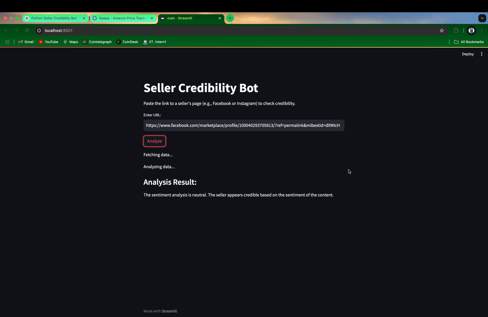

# Seller Credibility Bot

## Overview

Seller Credibility Bot is an AI-powered web application designed to analyze the credibility of online sellers. By providing a URL (such as a Facebook or Instagram seller page), the bot extracts relevant text-based data and runs a sentiment analysis using:

- **NLTK's VADER Sentiment Analyzer** to assess sentiment polarity.
- **Hugging Face's Transformer Pipeline** for advanced credibility assessment.

It then presents a recommendation on whether a seller appears trustworthy.

## Features

- **Extract Seller Data**: Fetches data from Facebook, Instagram, or other sources.
- **Sentiment Analysis**: Uses AI-powered sentiment scoring for credibility detection.
- **Simple UI**: A user-friendly Streamlit-based chat interface.
- **Real-time Analysis**: Processes seller data instantly and provides insights.

## Project Structure

```
seller_credibility_bot/
├── requirements.txt       # Dependencies
├── config.py              # Configuration file for API keys
├── main.py                # Entry point for Streamlit app
│
├── utils/                 # Utility functions
│   ├── __init__.py
│   ├── fetch_data.py      # Functions for extracting data
│   ├── analyze.py         # Functions for sentiment analysis
│
└── chat/                  # Chat-based UI
    ├── __init__.py
    └── chatbot.py         # Streamlit chat application
```

## Installation

1. **Clone this repository:**
   ```sh
   git clone https://github.com/deephabiswashi/seller-credibility-bot.git
   cd seller_credibility_bot
   ```

2. **Create and activate a virtual environment:**
   ```sh
   python -m venv env
   source env/bin/activate  # Windows: env\Scripts\activate
   ```

3. **Install dependencies:**
   ```sh
   pip install -r requirements.txt
   ```

## Usage

1. **Run the Streamlit app:**
   ```sh
   streamlit run main.py
   ```

2. **Enter a seller URL** (Facebook, Instagram, or generic) in the input field.
3. **View the analysis results**: The app will fetch text data and perform sentiment analysis to provide a credibility score.

## API Integration

This bot supports API integrations (optional for advanced users):
- **Facebook Graph API** (For fetching seller page posts)
- **Instagram Graph API** (For extracting seller profile data)
- **Amazon Product Review API** (For evaluating Amazon seller credibility)

To enable these, update `config.py` with valid API credentials.

## Screenshots

Here are some screenshots of the results page:




## Contributing

Contributions are welcome! If you'd like to improve this project, feel free to submit a pull request or open an issue.

## License

This project is licensed under the **MIT License**.

---
_Made with ❤️ by Deep Habswashi_

